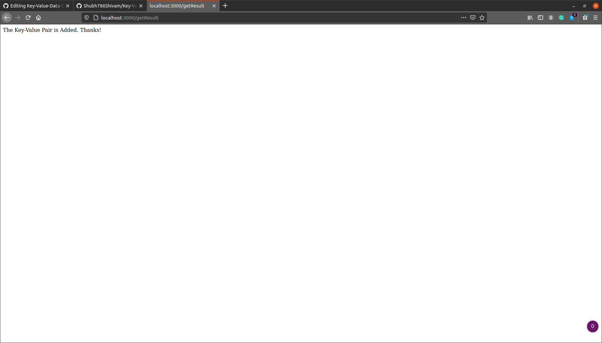

# Key-Value-Data-Store

#Image shows how files and folders are organised in the project.

#Prerequisites
1. You need to have node.js and node package manager installed in your computer.
2. You need to have express installed via node package manager.

#Initial Configuration of JSON File.

#Adding Key = Love and Value = Limitless.

#Greeting After Getting Word.

#Configuration of JSON File after adding Key-Value Pair.

